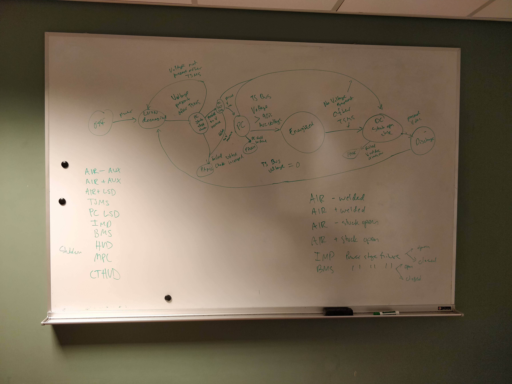
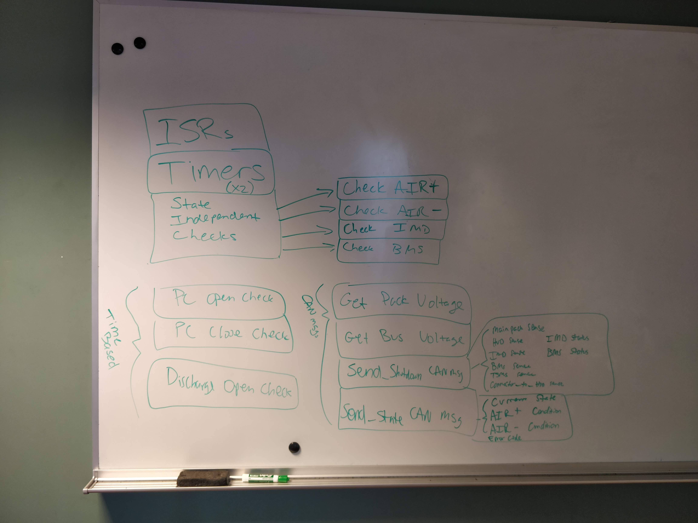

# SoftSysBreathOfFreshAIR
[Lucky Jordan](https://github.com/ljordan51) & [Peter Seger](https://github.com/segerpeter07)

## Project Goals
This project is inspiried by our work and experience on Olin Electric Motorsports (Formula) over the past 3 years working on electric vehicle firmware design and implementation. 

The Accumulator Isolation Relay (AIR) control board detects when the the tractive system master switch (TSMS) is closed and then completes the precharge sequence by closing the precharge relay until the TS bus reaches 90% of the accumulator voltage and then opening the precharge relay and closing the high side AIR. During this process, it detects a number of faults including failures of the AIRs and other safety system relays and opens the high side AIR in the case of a fault. 

Both Lucky and I have been on Formula for the past 3 years and have written firmware for the past 3 vehicles. The AIR firmware is some of the most important code for the car and is also some of worst understood code in our entire codebase. We want to change that. 

Not only do we want to re-write the firmware to adhere more strictly to correct C coding structure, we want to make it significantly easier to understand to future team members. 

Since we already have working AIR code from previous years, our project's lower bound would be to just make sure we don't break that. Beyond that, we feel confident in re-working the code to work better for our car's efficiency and our team's longevity. 

## Learning Goals
### Lucky
I want to improve my understanding of how to structure larger blocks of code that manage complex state in C. I particularly want to focus on creating robust, readable code to the end of reducing the likelihood that important variables are edited in places where they shouldn't be or at least increasing the likelihood that those kinds of mistakes are easy to detect when debugging.

### Peter
Similarly to Lucky, I want to learn more about state management in a complex system. In addition, I want to learn more about building robust, error-resistent code that is highly re-useable. Another thing that I would love to learn, however might be outside the scope of this project, is firmware verification systems that would allow us (and others) to test/verify our firmware before it is loaded to our boards. This would be awesome to learn because it would have a big impact on our team.

## Progress
We started this project thinking about alternative state management logic to the traditional finite state machine (FSM) that we have historically used for this applicaiton. After doing some research and discussing alternatives with Riccardo, we determined that a FSM was still probably the best course of action for our logic based off its simplicity and limited scope. However, one thing that he recommended was to create a state diagram.

The state diagram has helped us better understand and keep track of all the possible states that our machine can be in as well as the important (and limited) transitions in and out of states. This has already helped us a lot with our high-level architecture planning. 

After creating the state diagram, we went to planning the high-level architecutre of the code that we need to write. This included defining all the chucks of logic that we might need grouped loosely into what could become functions. From this, we will be ready to define all the function headers and write the functions.

## Next Steps
1) Define function headers (Both of us)
2) Divide and conquer writing functions (Both of us)
3) Integrate and merge (Both of us)
4) Explore embedded simulation/testing frameworks (Lucky)
5) Document design decisions and make digital state diagram (Peter)

[Trello Board](https://trello.com/b/P1uwdoRG/breath-of-fresh-air) & [Github]()

